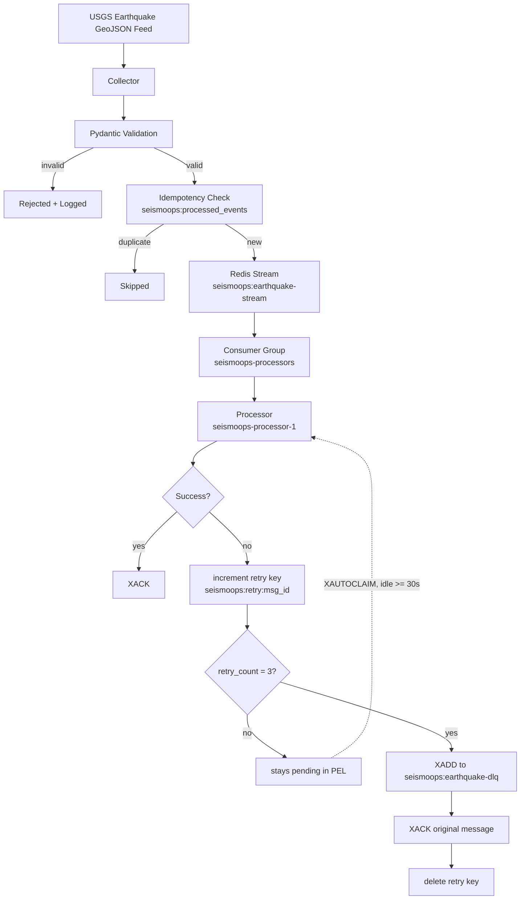

# SeismoOps Platform

An event-driven earthquake ingestion and processing platform built on Redis Streams. It ingests earthquake data from the USGS earthquake feed, validates it, and processes it through a Redis Consumer Group with automatic recovery of unacknowledged messages, bounded retries, and a dead-letter queue for events that fail repeatedly.

## Overview

The point of this project is not "fetch earthquake data from an API." It's the reliability engineering built around that ingestion: validation before anything is trusted, idempotent publishing, durable event storage, consumer-group-based delivery tracking, recovery of messages left unacknowledged by a failed consumer, bounded retries, and isolation of events that keep failing.

Two components make up the system:

- **Collector** (`services/collector/`) — a one-shot script that fetches the USGS GeoJSON feed, validates each event, and publishes new (non-duplicate) events to a Redis Stream.
- **Processor** (`services/processor/`) — a long-running service that consumes from that stream through a Redis Consumer Group, validates and processes each event, acknowledges successful ones, reclaims stale pending messages, retries failures a bounded number of times, and routes repeatedly failing events to a dead-letter stream.

The system was built incrementally — ingestion first, then idempotency, then a migration from simpler processing to Redis Streams and Consumer Groups, then a long-running processor, then pending-message recovery, then bounded retries and a dead-letter queue — with each stage closing a specific reliability gap left by the one before it.

## Architecture



The main data path is USGS → Collector → validation → idempotency check → Redis Stream → Consumer Group → Processor → validation → acknowledgement. Running alongside it is the reliability path: a message that isn't acknowledged stays in the consumer group's Pending Entries List, gets reclaimed by `XAUTOCLAIM` once idle long enough, and is retried until it succeeds or exhausts its retry budget and is written to the dead-letter stream.

## Why Redis Streams

A Redis List or Pub/Sub channel doesn't provide the consumer-group delivery tracking this project needs — once an item is popped or published, there's no record of whether it was actually handled. Redis Streams provide two things this project depends on directly:

- **Presistent, ordered entries.** Events are appended via `XADD` to `seismoops:earthquake-stream` and retained there regardless of consumption state — acknowledgement never deletes the entry.
- **Consumer-group delivery tracking.** The `seismoops-processors` group tracks, per consumer, which messages have been delivered but not yet acknowledged. That tracked state (the PEL) is what makes recovery, retries, and the DLQ possible at all.

## Event Processing Flow

1. The collector fetches the USGS feed and validates each candidate event against the shared `EarthquakeEvent` Pydantic model (`services/models.py`). Invalid events (bad coordinates, out-of-range depth, missing fields) are logged and dropped before they ever reach Redis.
2. For each valid event, a Lua script (`services/collector/redis_client.py`) atomically checks `seismoops:processed_events` and, if the event ID hasn't been published before, appends it to `seismoops:earthquake-stream` via `XADD` and records it in the set — in a single Redis round trip, so there's no race between checking and publishing.
3. The processor reads from the stream as consumer `seismoops-processor-1` in group `seismoops-processors`, using `XREADGROUP`.
4. Each message is re-validated against `EarthquakeEvent`, and on success acknowledged with `XACK`.

## Reliability and Failure Recovery

**Acknowledgement.** A message is only acknowledged with `XACK` after `process_message` has successfully validated and handled it — not on receipt. This is what makes the rest of the reliability model possible: if a crash happens between reading and finishing processing, the message is still recoverable.

**Pending Entries List.** Once a consumer reads a message via `XREADGROUP` but hasn't yet acknowledged it, Redis tracks that message as pending for the consumer group. It stays there until acknowledged or reclaimed.

**Recovery.** Before reading new messages on each loop iteration, the processor calls `XAUTOCLAIM` to reclaim messages that have been pending for at least the configured idle time:

```
RECOVERY_IDLE_TIME_MS = 30_000   # 30 seconds
RECOVERY_BATCH_SIZE = 10
```

In plain terms: if a message has been sitting unacknowledged for 30 seconds or longer — because the consumer that read it crashed, hung, or was killed — the processor picks it back up and tries it again, up to 10 at a time. This runs continuously as part of the processor's main loop, not as a separate cleanup job.

**Retry.** Each processing failure — a validation error, a JSON decode error, a Redis error — increments a retry counter stored at `seismoops:retry:<stream_id>`, with a 24-hour expiration refreshed on each increment. `MAX_RETRIES = 3`. A message that fails is not immediately given up on; it stays pending and gets a fresh attempt the next time `XAUTOCLAIM` reclaims it.

**Dead Letter Queue.** Once the retry counter reaches 3, the message is written to `seismoops:earthquake-dlq` — a Redis Stream used as a dead-letter queue, not a separate messaging system. The DLQ entry copies the original event fields and adds `original_stream_id` and `retry_count`. The original message is then `XACK`ed against `seismoops:earthquake-stream`, so it's removed from the PEL and won't be reclaimed again, and the retry key is deleted. This keeps events that fail deterministically (a malformed event will fail identically every time) from occupying the pending path indefinitely, while preserving the failed event and its retry history for manual inspection.

## Idempotency

Idempotency is enforced at publish time. The Lua script in `services/collector/redis_client.py` checks `SISMEMBER seismoops:processed_events <event_id>` and, only if absent, performs the `XADD` and `SADD` together atomically. This protects against re-publishing the same USGS event if the collector is run again and the feed still returns it — it does not, and is not meant to, prevent the processor from re-processing a message that's legitimately reclaimed via `XAUTOCLAIM`.

## Project Structure

```
seismoops-platform/
├── services/
│   ├── __init__.py
│   ├── models.py                # shared EarthquakeEvent model — imported by collector and processor
│   │
│   ├── collector/
│   │   ├── __init__.py
│   │   ├── main.py              # fetch USGS feed, validate, publish (one-shot)
│   │   ├── models.py            # earlier copy of EarthquakeEvent — not imported anywhere, unused
│   │   ├── redis_client.py      # Redis connection + Lua-script-based idempotent publish
│   │   └── test_publisher.py    # manual publish test
│   │
│   └── processor/
│       ├── __init__.py
│       ├── main.py              # long-running consumer: recovery, consumption, retry, DLQ
│       └── test_failure.py      # deliberately fails before XACK, to exercise recovery
│
├── .gitignore
├── README.md
└── requirements.txt
```

There is no `service/` (singular) directory in the current repository — only `services/`. `services/collector/models.py` duplicates `EarthquakeEvent` with a stricter depth constraint (`depth_km >= 0`) but is not imported by `services/collector/main.py`, which uses `services/models.py` instead (allowing the wider `-100` to `1000` km range documented in the USGS catalog); it appears to be left over from an earlier stage. There is no Dockerfile, `docker-compose.yml`, CI configuration, or license file in the repository.

## Technology Stack

**Implemented / current:**

- Python
- `requests`
- Pydantic (`2.13.4`)
- Redis `7.4.8`, Redis Streams, Redis Consumer Groups (`redis-py` `8.1.0`)
- Docker (used to run Redis locally; the application code itself is not containerized)
- Git / GitHub

**Planned, not implemented:** PostgreSQL persistence, an AI earthquake-intelligence service, Prometheus/Grafana observability, Kubernetes, CI/CD, Terraform, AWS deployment. None of these exist in the repository today.

## Local Development

### Prerequisites

- Python 3.10+
- Docker

### Install dependencies

```bash
pip install -r requirements.txt
```

### Start Redis

```bash
docker run -d \
  --name seismoops-redis \
  -p 6379:6379 \
  redis:7.4.8
```

On later runs, start the existing container instead of recreating it:

```bash
docker start seismoops-redis
docker exec -it seismoops-redis redis-cli ping   # expect PONG
```

Both services connect to `localhost:6379`, db `0`.

### Run the collector

```bash
python -m services.collector.main
```

Fetches the USGS feed, validates the first 5 features returned, and publishes any not already recorded in `seismoops:processed_events`. This is a single run — it does not poll continuously.

### Run the processor

```bash
python -m services.processor.main
```

Runs continuously. On each loop iteration it first reclaims pending messages idle for 30+ seconds via `XAUTOCLAIM`, then waits for new messages via `XREADGROUP` (blocking up to 5 seconds). Stop it with `Ctrl+C`.

### Useful Redis commands

```bash
# Total entries currently in the stream
docker exec seismoops-redis redis-cli XLEN seismoops:earthquake-stream

# Consumer group state
docker exec seismoops-redis redis-cli XINFO GROUPS seismoops:earthquake-stream

# Messages delivered but not yet acknowledged
docker exec seismoops-redis redis-cli XPENDING seismoops:earthquake-stream seismoops-processors

# Recent stream entries
docker exec seismoops-redis redis-cli XRANGE seismoops:earthquake-stream - + COUNT 5

# Dead-letter queue size and contents
docker exec seismoops-redis redis-cli XLEN seismoops:earthquake-dlq
docker exec seismoops-redis redis-cli XRANGE seismoops:earthquake-dlq - +

# Retry / idempotency keys
docker exec seismoops-redis redis-cli KEYS "seismoops:retry:*"
docker exec seismoops-redis redis-cli SMEMBERS seismoops:processed_events
```

## Testing / Verification

The following has been manually verified against a running local instance:

- USGS ingestion from the live feed
- Pydantic validation, including rejection of malformed events
- Idempotent duplicate prevention via the Lua-script publish path
- Redis Streams publishing (`XADD`) and consumer group delivery (`XREADGROUP`)
- Successful acknowledgement (`XACK`)
- Pending-message creation: a deliberately invalid event was published, consumed via `services/processor/test_failure.py` (which reads a message under a separate consumer name and raises before acknowledging it), and `XPENDING` confirmed the message entered the group's PEL
- Pending-message recovery: the normal processor, once started, reclaimed the pending message via `XAUTOCLAIM`
- Retry counting: because the test event was invalid, processing failed on each attempt, and the retry counter was observed progressing `retry=1/3`, `retry=2/3`, `retry=3/3`
- DLQ transfer: after the third failure, the event was written to `seismoops:earthquake-dlq`, and the original stream message was acknowledged, removing it from the PEL

This is manual reliability testing, exercised through `services/processor/test_failure.py` and direct Redis inspection — there is no automated test suite in the repository. It confirms the recovery → retry → DLQ path works as implemented under a single processor instance; it does not establish behavior under concurrent processors, sustained load, or Redis restarts.

## Roadmap

**Phase 1 — Data Ingestion** ✅
- [x] USGS earthquake collector
- [x] Pydantic validation
- [x] Structured logging

**Phase 2 — Event Infrastructure** ✅
- [x] Redis integration
- [x] Idempotent ingestion
- [x] Redis Streams
- [x] Consumer Groups
- [x] XACK acknowledgement

**Phase 3 — Reliable Processing** ✅
- [x] Continuous processor worker
- [x] Pending-message recovery (`XAUTOCLAIM`)
- [x] Bounded retry handling
- [x] Dead-letter queue

**Phase 4 — Persistence** (planned)
- [ ] PostgreSQL integration
- [ ] Historical earthquake storage
- [ ] Query API

**Phase 5 — AI Intelligence** (planned)
- [ ] AI analysis service
- [ ] Severity classification
- [ ] Event summarization / risk analysis
- [ ] Intelligent alerting

**Phase 6 — Observability** (planned)
- [ ] Prometheus / Grafana
- [ ] Metrics and dashboards
- [ ] Alerting

**Phase 7 — Cloud / DevOps** (planned)
- [ ] Docker Compose / containerized services
- [ ] Kubernetes
- [ ] CI/CD
- [ ] Cost-conscious AWS deployment

## Current Limitations

- The collector is not scheduled — it's a one-shot script with no built-in polling loop or cron integration.
- The collector processes only the first 5 features returned per run, a fixed cap in the current code.
- No persistence beyond Redis — a successfully processed event isn't stored anywhere after acknowledgement.
- The DLQ has no consumer — failed events accumulate in `seismoops:earthquake-dlq` with nothing currently reading, alerting on, or replaying them.
- Only Redis is containerized; the collector and processor run as local Python processes with hardcoded connection settings.
- `CONSUMER_NAME = "seismoops-processor-1"` is hardcoded, so running two processor instances at once would have both claim the same consumer identity rather than scaling out independently.
- No automated tests — `test_publisher.py` and `test_failure.py` are manual verification scripts.

## License

No license file is present in the repository.

## Author

**Shashi Dev (G. Shashi Karan)**
[GitHub](https://github.com/ShashiKaran-git) · [LinkedIn](https://linkedin.com/in/shashikaran)