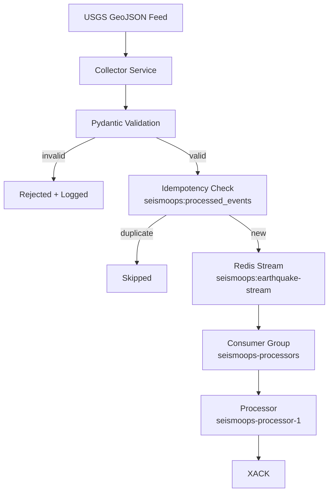
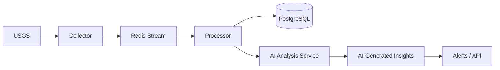
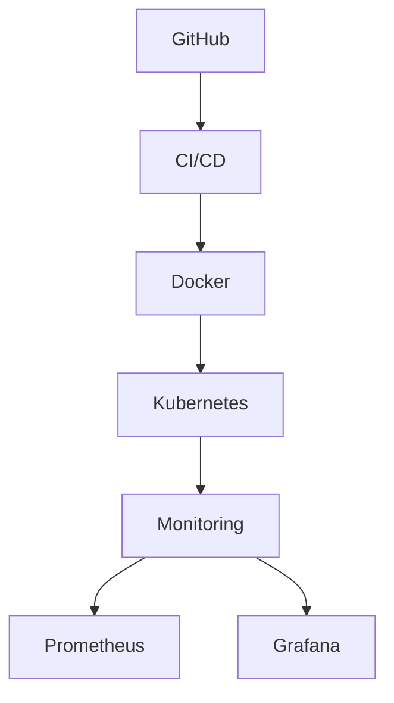

# SeismoOps Platform

Event-driven earthquake monitoring and processing platform built on Redis Streams, with a roadmap toward persistence, AI-based earthquake intelligence, and cloud-native deployment.

## Overview

SeismoOps ingests USGS earthquake data from a frequently updated GeoJSON feed, validates and normalizes each event, guarantees idempotent ingestion, and publishes valid events onto a Redis Stream for reliable, acknowledgement-based processing via Redis Consumer Groups.

The project is being built incrementally rather than as a single API-to-database script. Each stage was added deliberately to demonstrate a specific engineering concern — data validation, deduplication, at-least-once delivery, and consumer-group-based processing — before moving on to persistence, AI analysis, observability, and cloud deployment.

## Why This Project Exists

It's easy to build a script that calls an API and prints the response. SeismoOps is intentionally scoped around the harder, more transferable problems in data platform engineering:

- **Validation** — rejecting malformed upstream data before it enters the system
- **Idempotency** — safely handling a feed that may redeliver the same event
- **Event-driven processing** — decoupling ingestion from processing via a durable stream
- **Reliable delivery** — explicit acknowledgement instead of "fire and forget" consumption
- **Incremental architecture** — evolving the design as new failure modes are discovered, rather than over-engineering upfront

The USGS API call is the least interesting part of this project. What happens after the data arrives is the point.

## Architecture

```
USGS Earthquake GeoJSON Feed
        │
        ▼
  Collector Service
        │
        ▼
 Pydantic Validation
        │
        ▼
Idempotent Event Check  ──duplicate──▶ (skipped)
        │
        ▼
   Redis Stream
 (seismoops:earthquake-stream)
        │
        ▼
 Redis Consumer Group
 (seismoops-processors)
        │
        ▼
  Processor Service
        │
        ▼
       XACK
```

### Diagram (Mermaid)



## Current Features (Implemented)

| Feature | Status | Notes |
|---|---|---|
| USGS earthquake collection | ✅ Implemented | Polls the USGS GeoJSON feed; extracts event ID, magnitude, place, lat/lon, depth, timestamp, source |
| Pydantic validation | ✅ Implemented | Invalid events rejected and logged — verified against a real malformed USGS record (negative depth) |
| Idempotent ingestion | ✅ Implemented | Redis key `seismoops:processed_events` tracks seen event IDs; duplicates are skipped, not re-published |
| Redis integration | ✅ Implemented | Redis 7.4.8, running in Docker (`seismoops-redis`, `localhost:6379`) |
| Redis Streams | ✅ Implemented | Migrated from an earlier Redis List design to `seismoops:earthquake-stream` |
| Redis Consumer Groups | ✅ Implemented | Group `seismoops-processors`, consumer `seismoops-processor-1`, via `XREADGROUP` |
| Acknowledgement-based processing | ✅ Implemented | Processor acknowledges successfully handled events with `XACK` |
| Dockerized infrastructure | ✅ Implemented | Redis currently runs as a Docker container as the local infra layer |

## Reliability Design

The processor follows an explicit read → process → acknowledge sequence:

```
XREADGROUP  →  validate/process event  →  XACK
```

It's worth being precise about what each piece actually does, since these terms are often conflated:

- **Redis Stream** — retains the event entry. Entries are not deleted by acknowledgement.
- **Consumer Group** — tracks per-consumer delivery and acknowledgement state for the stream.
- **XACK** — removes the message from the consumer group's Pending Entries List (PEL). It does **not** delete the entry from the stream itself.

This distinction matters for reliability: if a consumer crashes after `XREADGROUP` but before `XACK`, the message remains in the PEL rather than being silently lost, which is the foundation for retry/recovery handling (planned — see [Roadmap](#roadmap)). Automatic retry logic is not implemented yet; today, a failed message stays pending and requires manual inspection via `XPENDING`.

To verify correct behavior, Redis Consumer Group state was inspected directly:

- **`XLEN`** — total number of entries currently in the stream
- **`XPENDING`** — messages delivered to the consumer group but not yet acknowledged
- **Consumer group lag** — messages in the stream not yet delivered to the group

Using these, it was confirmed that messages are delivered, processed, and acknowledged correctly, with `XPENDING` returning to empty after successful processing.

## Technology Stack

**Currently used:**

- Python
- `requests`
- Pydantic
- Redis (Streams + Consumer Groups)
- Docker
- Git / GitHub

**Planned, not yet implemented:** PostgreSQL, an AI analysis service, Prometheus, Grafana, Kubernetes, CI/CD, Terraform, AWS. These are not currently part of the running system — see [Roadmap](#roadmap).

## Project Structure

```
seismoops-platform/
│
├── services/
│   ├── __init__.py
│   ├── models.py
│   │
│   ├── collector/
│   │   ├── __init__.py
│   │   ├── main.py
│   │   ├── redis_client.py
│   │   └── test_publisher.py
│   │
│   └── processor/
│       ├── __init__.py
│       └── main.py
│
├── .gitignore
├── README.md
└── requirements.txt
```

`services/models.py` contains the shared `EarthquakeEvent` model used by both the collector and the processor. Some legacy files from earlier development stages may still exist in the repository and are scheduled for cleanup.

## How the System Works

1. The **collector** polls the USGS earthquake GeoJSON feed and parses incoming events.
2. Each event is validated against the shared `EarthquakeEvent` Pydantic model (`services/models.py`); invalid events are logged and dropped.
3. The collector checks the event ID against `seismoops:processed_events` in Redis to avoid re-publishing duplicates.
4. Valid, new events are published to the `seismoops:earthquake-stream` Redis Stream.
5. The **processor** reads from the stream via the `seismoops-processors` consumer group using `XREADGROUP`.
6. After successful processing, the processor sends `XACK`, removing the message from the group's pending entries (the stream entry itself is retained).

The processor currently consumes one available event per execution and exits — it is not yet a long-running worker. Continuous processing is a planned Phase 3 item (see [Roadmap](#roadmap)).

## Local Setup

### Prerequisites

- Python 3.10+
- Docker

### Running Redis

If the container already exists (typical day-to-day workflow):

```bash
docker start seismoops-redis
docker exec -it seismoops-redis redis-cli ping
# Expected: PONG
```

If setting up a fresh environment (no existing container):

```bash
docker run -d \
  --name seismoops-redis \
  -p 6379:6379 \
  redis:7.4.8
```

Use `docker run` only to create the container the first time; use `docker start` to bring up the existing container afterward.

### Install dependencies

```bash
pip install -r requirements.txt
```

### Running the collector

```bash
python -m services.collector.main
```

### Running the processor

```bash
python -m services.processor.main
```

This consumes one available event from the stream and exits.

## Redis Debugging Commands

Commands run against the Dockerized Redis instance:

```bash
# Check stream length (total entries in the stream)
docker exec seismoops-redis redis-cli XLEN seismoops:earthquake-stream

# Inspect consumer group state
docker exec seismoops-redis redis-cli XINFO GROUPS seismoops:earthquake-stream

# Inspect pending (delivered but unacknowledged) messages
docker exec seismoops-redis redis-cli XPENDING seismoops:earthquake-stream seismoops-processors

# View recent stream entries
docker exec seismoops-redis redis-cli XRANGE seismoops:earthquake-stream - + COUNT 5

# Check the idempotency set
docker exec seismoops-redis redis-cli SMEMBERS seismoops:processed_events

# Basic connectivity check
docker exec -it seismoops-redis redis-cli ping
```

## Testing / Verification

The following behaviors have been manually verified against a running local instance:

- USGS data ingestion from the live feed
- Pydantic validation, including rejection of a real malformed record (negative depth)
- Idempotent duplicate prevention
- Redis Streams publishing
- Redis Consumer Group delivery via `XREADGROUP`
- Acknowledgement via `XACK`
- `XPENDING` returning to empty after successful acknowledgement
- Consumer group state inspection via `XINFO GROUPS`
- Redis running correctly in Docker

Verification is currently manual. Automated test coverage has not been added yet — see [Roadmap](#roadmap).

## AI Roadmap (Planned)

No AI functionality is implemented yet. The goal is not to bolt on a chatbot, but to add genuinely useful earthquake intelligence on top of the existing event-processing pipeline:

- Earthquake severity classification
- Natural-language event summaries
- Impact / risk analysis
- Anomaly detection across events
- Intelligent, threshold-based alerting

**Planned future architecture:**



## DevOps Roadmap (Planned)



Target future data path:

```
USGS → Collector → Redis Streams → Consumer Group → Processor Workers
     → PostgreSQL → AI Analysis Service → API / Dashboard → Users
```

Given development is happening on limited AWS free-tier credits, the cloud architecture is intentionally being kept lightweight — self-managed containers and a small number of managed services rather than a wide footprint of AWS-managed offerings, at least during the free-credit phase.

## Project Status

Actively in development. The ingestion and event-processing core — collector, validation, idempotency, Redis Streams, consumer group, and acknowledgement — is implemented and manually verified. The processor currently runs as a single-execution consumer rather than a continuous worker. Persistence, AI analysis, observability, and cloud/Kubernetes deployment are planned but not yet built.

## Roadmap

**Phase 1 — Data Ingestion**
- [x] USGS earthquake collector
- [x] Pydantic validation
- [x] Structured logging

**Phase 2 — Event Infrastructure**
- [x] Redis integration
- [x] Idempotent ingestion
- [x] Redis Streams
- [x] Consumer Groups
- [x] XACK acknowledgement

**Phase 3 — Reliable Processing**
- [ ] Continuous processor worker
- [ ] Retry / recovery handling
- [ ] Dead-letter handling
- [ ] Improved failure handling

**Phase 4 — Persistence**
- [ ] PostgreSQL integration
- [ ] Earthquake database schema
- [ ] Historical storage
- [ ] Query API

**Phase 5 — AI Intelligence**
- [ ] AI analysis service
- [ ] Severity classification
- [ ] Event summarization
- [ ] Risk analysis
- [ ] Intelligent alerts

**Phase 6 — Observability**
- [ ] Prometheus
- [ ] Grafana
- [ ] Metrics
- [ ] Dashboards
- [ ] Alerting

**Phase 7 — Cloud / DevOps**
- [ ] Docker Compose
- [ ] Kubernetes
- [ ] Horizontal processor scaling
- [ ] CI/CD
- [ ] Cost-conscious AWS deployment

## Author

**Shashi Dev (G. Shashi Karan)**
[GitHub](https://github.com/ShashiKaran-git) · [LinkedIn](https://linkedin.com/in/shashikaran)